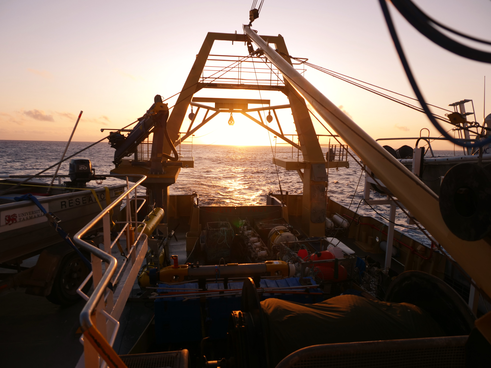

Lead Authors: K. Picard1, A. Leplastrier1, K. Austine2, N. Bergersen3, R. Cullen4, N. Dando1, D. Donohue5, S. Edwards6, T. Ingleton7, A. Jordan8, V. Lucieer9, I. Parnum10, J. Siwabessy1, M. Spinoccia1, R. Talbot-Smith11, C. Waterson4

Contributing Authors: N. Barrett9, R. Beaman12, D. Bergersen3, M. Boyd6, B. Brace4, B. Brooke1, O. Cantrill13, M. Case14, J. Daniell12, S. Dunne4, M. Fellows1, U. Harris15, D. Ierodiaconou16, E. Johnstone5, P. Kennedy17, A. Lewis1, S. Lytton4, K. Mackay18, S. McLennan1, C. Mitchell1, S. Nichol1, A. Post1, A. Price19, R. Przeslawski1, L. Pugsley20, N. Quadros21, J. Smith1, W. Stewart4, J. Sullivan22, M. Tran1, T. Whiteway1

1Geoscience Australia, 2EGS Survey, 3Acoustic Imaging, 4Australian Hydrographic Office, 5IXSurvey, 6Commonwealth Scientific and Industrial Research Organisation Marine National Facility, 7NSW Department of Planning, Industry and Environment, 8NSW Department of Primary Industries, 9University of Tasmania, 10Curtin University, 11Department of Transport Western Australia, 12James Cook University, 13Queensland Department of Transport and Main Roads, 14Australian Institute of Marine Science, 15Australian Antarctic Division, 16Deakin University, 17Fugro, 18National Institute of Water and  Atmospheric Research, 19Land Information New Zealand, 20Australian Maritime Safety Authority, 21FrontierSI, 22Department of Infrastructure, Regional Development and Cities. 

**Department of Industry, Innovation and Science**

Minister for Resources, Water and Northern Australia: the Hon Keith Pitt
Secretary: Dr Heather Smith PSM

**Geoscience Australia**

Chief Executive Officer: Dr James Johnson
This paper is published with the permission of the CEO, Geoscience Australia

© Commonwealth of Australia (Geoscience Australia) 2018

With the exception of the Commonwealth Coat of Arms and where otherwise noted, this product is provided under a Creative Commons Attribution 4.0 International Licence. ([http://creativecommons.org/licenses/by/4.0/legalcode](http://creativecommons.org/licenses/by/4.0/legalcode))

Geoscience Australia has tried to make the information in this product as accurate as possible. However, it does not guarantee that the information is totally accurate or complete. Therefore, you should not solely rely on this information when making a commercial decision.

Geoscience Australia is committed to providing web accessible content wherever possible. If you are having difficulties with accessing this document please email [clientservices@ga.gov.au](mailto:clientservices@ga.gov.au)

**ISSN 2201-702X (PDF)**

**ISBN 978-1-925297-89-8 (PDF)**

**eCat 121571**

**Bibliographic reference:** Picard, K., Austine, K., Bergersen, N., Cullen, R., Dando, N., Donohue, D., Edwards, S., Ingleton, T., Jordan, A., Lucieer, V., Parnum, I., Siwabessy, J., Spinoccia, M., Talbot-Smith, R., Waterson, C., Barrett, N., Beaman, R., Bergersen, D., Boyd, M., Brace, B., Brooke, B., Cantrill, O., Case, M., Daniell, J., Dunne, S., Fellows, M., Harris, U., Ierodiaconou, D., Johnstone, E., Kennedy, P., Leplastrier, A., Lewis, A., Lytton, S., Mackay, K., McLennan, S., Mitchell, C., Monk, J., Nichol, S., Post, A., Price, A., Przeslawski, R., Pugsley, L., Quadros, N., Smith, J., Stewart, W., Sullivan J., Tran, M., Whiteway, T., 2018. Australian Multibeam Guidelines. Record 2018/19. Geoscience Australia, Canberra. [http://dx.doi.org/10.11636/Record.2018.019](http://dx.doi.org/10.11636/Record.2018.019)

Version: 1801

<table>
<thead>
  <tr>
    <th>Chapter Contents</th>
  </tr>
</thead>
<tbody>
  <tr>
    <td><a href="https://australian-multibeam-guidelines.github.io/introduction"><strong>1. Introduction</strong></a></td>
  </tr>
  <tr>
    <td><a href="https://australian-multibeam-guidelines.github.io/introduction#11-scope"><i>1.1 Scope</i></a></td>
  </tr>
  <tr>
    <td><a href="https://australian-multibeam-guidelines.github.io/introduction#12-how-to-use-guidelines"><i>1.2 How to use guidelines</i></a></td>
  </tr>
  <tr>
    <td><a href="https://australian-multibeam-guidelines.github.io/introduction#13-related-standards-and-publications"><i>1.3 Related standards and publications</i></a></td>
  </tr>
  <tr>
    <td><a href="https://australian-multibeam-guidelines.github.io/pre-survey-planning"><strong>2. Pre-survey Planning</strong></a></td>
  </tr>
  <tr>
    <td><a href="https://australian-multibeam-guidelines.github.io/pre-survey-planning#21-national-coverage-consultation-and-upcoming-survey-register"><i>2.1 National coverage consultation and upcoming survey register</i></a></td>
  </tr>
  <tr>
    <td><a href="https://australian-multibeam-guidelines.github.io/pre-survey-planning#211-existing-data-coverage">2.1.1 Existing Data coverage</a></td>
  </tr>
  <tr>
    <td><a href="https://australian-multibeam-guidelines.github.io/pre-survey-planning#212-national-bathymetry-priorities">2.1.2 National Bathymetry priorities</a></td>
  </tr>
  <tr>
    <td><a href="https://australian-multibeam-guidelines.github.io/pre-survey-planning#213-ausseabed-coordination-tool">2.1.3 AusSeabed Coordination Tool</a></td>
  </tr>
  <tr>
    <td><a href="https://australian-multibeam-guidelines.github.io/pre-survey-planning#22-research-and-survey-permits"><i>2.2 Research and survey permits</i></a></td>
  </tr>
  <tr>
    <td><a href="https://australian-multibeam-guidelines.github.io/pre-survey-planning#23-seabed-mapping-data-collection-considerations"><i>2.3 Seabed mapping data collection considerations</i></a></td>
  </tr>
  <tr>
    <td><a href="https://australian-multibeam-guidelines.github.io/pre-survey-planning#231-data-type-formats-and-metadata">2.3.1 Data type, formats, and metadata</a></td>
  </tr>
  <tr>
    <td><a href="https://australian-multibeam-guidelines.github.io/pre-survey-planning#232-survey-area-characterization">2.3.2 Survey area characterization</a></td>
  </tr>
  <tr>
    <td><a href="https://australian-multibeam-guidelines.github.io/pre-survey-planning#233-data-representation-seafloor-coverage-and-resolution">2.3.3 Data representation (seafloor coverage and resolution)</a></td>
  </tr>
  <tr>
    <td><a href="https://australian-multibeam-guidelines.github.io/pre-survey-planning#234-quality-assessment--uncertainty-scheme">2.3.4 Quality assessment / uncertainty scheme</a></td>
  </tr>
  <tr>
    <td><a href="https://australian-multibeam-guidelines.github.io/pre-survey-planning#235-platforms--systems">2.3.5 Platforms &amp; Systems</a></td>
  </tr>
  <tr>
    <td><a href="https://australian-multibeam-guidelines.github.io/pre-survey-planning#236-dimension-control-of-sensor-offsets">2.3.6 Dimension control of sensor offsets</a></td>
  </tr>
  <tr>
    <td><a href="https://australian-multibeam-guidelines.github.io/pre-survey-planning#24-project-team"><i>2.4 Project team</i></a></td>
  </tr>
  <tr>
    <td><a href="https://australian-multibeam-guidelines.github.io/pre-survey-planning#25-field-survey-instructions"><i>2.5 Field survey instructions</i></a></td>
  </tr>
  <tr>
    <td><a href="https://australian-multibeam-guidelines.github.io/pre-survey-planning#251-geodetic-control-and-horizontal-datum">2.5.1 Geodetic control and Horizontal Datum</a></td>
  </tr>
  <tr>
    <td><a href="https://australian-multibeam-guidelines.github.io/pre-survey-planning#252-tidal-or-ellipsoidal-datum">2.5.2 Tidal or ellipsoidal datum</a></td>
  </tr>
  <tr>
    <td><a href="https://australian-multibeam-guidelines.github.io/pre-survey-planning#253-sound-velocity-profiling">2.5.3 Sound velocity profiling</a></td>
  </tr>
  <tr>
    <td><a href="https://australian-multibeam-guidelines.github.io/pre-survey-planning#254-time-and-date">2.5.4 Time and date</a></td>
  </tr>
  <tr>
    <td><a href="https://australian-multibeam-guidelines.github.io/pre-survey-planning#255-line-planning">2.5.5 Line planning</a></td>
  </tr>
  <tr>
    <td><a href="https://australian-multibeam-guidelines.github.io/pre-survey-planning#256-seabed-samples">2.5.6 Seabed samples</a></td>
  </tr>
  <tr>
    <td><a href="https://australian-multibeam-guidelines.github.io/pre-survey-planning#26-submission-of-plan-data-and-notifications"><i>2.6 Submission of plan, data and notifications</i></a></td>
  </tr>
  <tr>
    <td><a href="https://australian-multibeam-guidelines.github.io/mobilisation-calibration-validation"><strong>3. Mobilisation, Calibration and Validation</strong></a></td>
  </tr>
  <tr>
    <td><a href="https://australian-multibeam-guidelines.github.io/mobilisation-calibration-validation#31-overview"><i>3.1 Overview</i></a></td>
  </tr>
  <tr>
    <td><a href="https://australian-multibeam-guidelines.github.io/mobilisation-calibration-validation#32-dimensional-control"><i>3.2 Dimensional control</i></a></td>
  </tr>
  <tr>
    <td><a href="https://australian-multibeam-guidelines.github.io/mobilisation-calibration-validation#321-physical-offset-survey">3.2.1 Physical offset survey</a></td>
  </tr>
  <tr>
    <td><a href="https://australian-multibeam-guidelines.github.io/mobilisation-calibration-validation#322-rotation-offset-survey">3.2.2 Rotation offset survey</a></td>
  </tr>
  <tr>
    <td><a href="https://australian-multibeam-guidelines.github.io/mobilisation-calibration-validation#33-horizontal-positioning"><i>3.3 Horizontal positioning</i></a></td>
  </tr>
  <tr>
    <td><a href="https://australian-multibeam-guidelines.github.io/mobilisation-calibration-validation#34-vertical-positioning"><i>3.4 Vertical positioning</i></a></td>
  </tr>
  <tr>
    <td><a href="https://australian-multibeam-guidelines.github.io/mobilisation-calibration-validation#341-depth-validation">3.4.1 Depth validation</a></td>
  </tr>
  <tr>
    <td><a href="https://australian-multibeam-guidelines.github.io/mobilisation-calibration-validation#342-settlement-and-squat">3.4.2 Settlement and squat</a></td>
  </tr>
  <tr>
    <td><a href="https://australian-multibeam-guidelines.github.io/mobilisation-calibration-validation#343-vessel-draft">3.4.3 Vessel draft</a></td>
  </tr>
  <tr>
    <td><a href="https://australian-multibeam-guidelines.github.io/mobilisation-calibration-validation#344-sound-velocity">3.4.4 Sound velocity</a></td>
  </tr>
  <tr>
    <td><a href="https://australian-multibeam-guidelines.github.io/mobilisation-calibration-validation#345-tidal-station">3.4.5 Tidal station</a></td>
  </tr>
  <tr>
    <td><a href="https://australian-multibeam-guidelines.github.io/mobilisation-calibration-validation#35-patch-test"><i>3.5 Patch test</i></a></td>
  </tr>
  <tr>
    <td><a href="https://australian-multibeam-guidelines.github.io/mobilisation-calibration-validation#36-seafloor-backscatter-calibration"><i>3.6 Seafloor backscatter calibration</i></a></td>
  </tr>
  <tr>
    <td><a href="https://australian-multibeam-guidelines.github.io/mobilisation-calibration-validation#37-water-column-backscatter-calibration"><i>3.7 Water column backscatter calibration</i></a></td>
  </tr>
  <tr>
    <td><a href="https://australian-multibeam-guidelines.github.io/mobilisation-calibration-validation#38-built-in-systems-test"><i>3.8 Built-in systems test</i></a></td>
  </tr>
  <tr>
    <td><a href="https://australian-multibeam-guidelines.github.io/mobilisation-calibration-validation#39-final-acceptance-test"><i>3.9 Final acceptance test</i></a></td>
  </tr>
  <tr>
    <td><a href="https://australian-multibeam-guidelines.github.io/acquisition"><strong>4. Acquisition</strong></a></td>
  </tr>
  <tr>
    <td><a href="https://australian-multibeam-guidelines.github.io/acquisition#41-survey-plan"><i>4.1 Survey plan</i></a></td>
  </tr>
  <tr>
    <td><a href="https://australian-multibeam-guidelines.github.io/acquisition#42-project-structure-and-nomenclature"><i>4.2 Project structure and nomenclature</i></a></td>
  </tr>
  <tr>
    <td><a href="https://australian-multibeam-guidelines.github.io/acquisition#43-systems-settings"><i>4.3 Systems settings</i></a></td>
  </tr>
  <tr>
    <td><a href="https://australian-multibeam-guidelines.github.io/acquisition#431-bathymetry">4.3.1 Bathymetry</a></td>
  </tr>
  <tr>
    <td><a href="https://australian-multibeam-guidelines.github.io/acquisition#432-backscatter">4.3.2 Backscatter</a></td>
  </tr>
  <tr>
    <td><a href="https://australian-multibeam-guidelines.github.io/acquisition#433-transit-data">4.3.3 Transit data</a></td>
  </tr>
  <tr>
    <td><a href="https://australian-multibeam-guidelines.github.io/acquisition#44-ancillary-systems"><i>4.4 Ancillary systems</i></a></td>
  </tr>
  <tr>
    <td><a href="https://australian-multibeam-guidelines.github.io/acquisition#441-sound-velocity-profile">4.4.1 Sound Velocity Profile</a></td>
  </tr>
  <tr>
    <td><a href="https://australian-multibeam-guidelines.github.io/acquisition#442-tides">4.4.2 Tides</a></td>
  </tr>
  <tr>
    <td><a href="https://australian-multibeam-guidelines.github.io/acquisition#45-monitoring-qaqc--data-backup"><i>4.5 Monitoring, QA/QC &amp; Data backup</i></a></td>
  </tr>
  <tr>
    <td><a href="https://australian-multibeam-guidelines.github.io/acquisition#451-gnss-positioning">4.5.1 GNSS positioning</a></td>
  </tr>
  <tr>
    <td><a href="https://australian-multibeam-guidelines.github.io/acquisition#46-mandatory-notifications"><i>4.6 Mandatory notifications</i></a></td>
  </tr>
  <tr>
    <td><a href="https://australian-multibeam-guidelines.github.io/acquisition#461-dangers-found--hydrographic-notes">4.6.1 Dangers found – hydrographic notes</a></td>
  </tr>
  <tr>
    <td><a href="https://australian-multibeam-guidelines.github.io/acquisition#462-underwater-cultural-heritage-notification">4.6.2 Underwater cultural heritage notification</a></td>
  </tr>
  <tr>
    <td><a href="https://australian-multibeam-guidelines.github.io/data-processing"><strong>5. Data Processing<strong></a></td>
  </tr>
  <tr>
    <td><a href="https://australian-multibeam-guidelines.github.io/data-processing#51-data-processing-considerations"><i>5.1 Data processing considerations</i></a></td>
  </tr>
  <tr>
    <td><a href="https://australian-multibeam-guidelines.github.io/data-processing#511-during-survey">5.1.1 During survey</a></td>
  </tr>
  <tr>
    <td><a href="https://australian-multibeam-guidelines.github.io/data-processing#512-post-survey">5.1.2 Post-survey</a></td>
  </tr>
  <tr>
    <td><a href="https://australian-multibeam-guidelines.github.io/data-processing#513-backscatter-processing-requirements">5.1.3 Backscatter processing requirements</a></td>
  </tr>
  <tr>
    <td><a href="https://australian-multibeam-guidelines.github.io/data-processing#52-total-propagated-uncertainties-tpu"><i>5.2 Total propagated uncertainties (TPU)</i></a></td>
  </tr>
  <tr>
    <td><a href="https://australian-multibeam-guidelines.github.io/reports"><strong>6. Reports</strong></a></td>
  </tr>
  <tr>
    <td><a href="https://australian-multibeam-guidelines.github.io/reports#61-mobilisation-calibration-and-validation-records"><i>6.1 Mobilisation, calibration and validation records</i></a></td>
  </tr>
  <tr>
    <td><a href="https://australian-multibeam-guidelines.github.io/reports#611-logs">6.1.1 Logs</a></td>
  </tr>
  <tr>
    <td><a href="https://australian-multibeam-guidelines.github.io/reports#612-report">6.1.2 Report</a></td>
  </tr>
  <tr>
    <td><a href="https://australian-multibeam-guidelines.github.io/reports#62-record-keeping"><i>6.2 Record Keeping</i></a></td>
  </tr>
  <tr>
    <td><a href="https://australian-multibeam-guidelines.github.io/reports#621-logs">6.2.1 Logs</a></td>
  </tr>
  <tr>
    <td><a href="https://australian-multibeam-guidelines.github.io/reports#622-report-of-survey">6.2.2 Report of Survey</a></td>
  </tr>
  <tr>
    <td><a href="https://australian-multibeam-guidelines.github.io/data-release"><strong>7. Data Release<strong></a></td>
  </tr>
  <tr>
    <td><a href="https://australian-multibeam-guidelines.github.io/data-release#71-final-qaqc"><i>7.1 Final QA/QC</i></a></td>
  </tr>
  <tr>
    <td><a href="https://australian-multibeam-guidelines.github.io/data-release#72-data-submission-to-ausseabed"><i>7.2 Data Submission to AusSeabed</i></a></td>
  </tr>
  <tr>
    <td><a href="https://australian-multibeam-guidelines.github.io/marine-monitoring"><strong>8. Multibeam Acoustics for Marine Monitoring</strong></a></td>
  </tr>
  <tr>
    <td><a href="https://australian-multibeam-guidelines.github.io/references"><strong>9. References</strong></a></td>
  </tr>
  <tr>
    <td><a href="https://australian-multibeam-guidelines.github.io/appendices"><strong>Appendices</strong></a></td>
  </tr>
</tbody>
</table>