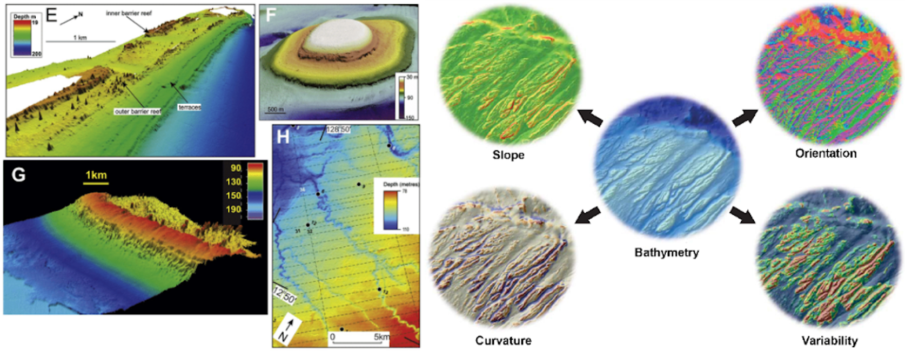

[Vanessa Lucieer](mailto:vanessa.lucieer@utas.edu.au), Kim Picard, Justy Siwabessy, Alan Jordan, Maggie Tran, Jacquomo Monk

Chapter citation:
Lucieer V, Picard K, Siwabessy J, Jordan A, Tran M, Monk J. 2018. Seafloor mapping field manual for multibeam sonar. In Field Manuals for Marine Sampling to Monitor Australian Waters, Przeslawski R, Foster S (Eds). National Environmental Science Programme (NESP). pp 42-64. 



# Chapter Contents 

### [Platform Description](https://multibeam-echosounder-field-manual.github.io/platform-description)
### [Scope](https://multibeam-echosounder-field-manual.github.io/scope)
### [Multibeam Acoustics for Marine Monitoring](https://multibeam-echosounder-field-manual.github.io/multibeam-acoustics-for-marine-monitoring)

### [Pre-Survey Preparations](https://multibeam-echosounder-field-manual.github.io/pre-survey-preparations)
### [Data Acquisition](https://multibeam-echosounder-field-manual.github.io/data-acquisition)
##### * [Installation offsets](https://multibeam-echosounder-field-manual.github.io/data-acquisition#installation-offsets)
##### * [Data logging](https://multibeam-echosounder-field-manual.github.io/data-acquisition#data-logging)
##### - [Sound velocity profiles](https://multibeam-echosounder-field-manual.github.io/data-acquisition#sound-velocity-profiles)
##### - [Geodetic parameters](https://multibeam-echosounder-field-manual.github.io/data-acquisition#geodetic-parameters)
##### - [Survey speed](https://multibeam-echosounder-field-manual.github.io/data-acquisition#survey-speed)
##### - [Line spacing](https://multibeam-echosounder-field-manual.github.io/data-acquisition#line-spacing)
##### - [Pulse length](https://multibeam-echosounder-field-manual.github.io/data-acquisition#pulse-length)
##### - [Tides and GPS tides](https://multibeam-echosounder-field-manual.github.io/data-acquisition#tides-and-gps-tides)
### [Data Processing](https://multibeam-echosounder-field-manual.github.io/data-processing)
##### - [Bathymetric data processing](https://multibeam-echosounder-field-manual.github.io/data-processing#bathymetric-data-processing)
##### - [Backscatter data processing](https://multibeam-echosounder-field-manual.github.io/data-processing#backscatter-data-processing)
### [Data Interpretation](https://multibeam-echosounder-field-manual.github.io/data-interpretation)
### [Data Release](https://multibeam-echosounder-field-manual.github.io/data-release)
### [Field Manual Maintenance](https://multibeam-echosounder-field-manual.github.io/field-manual-maintenance)
### [References](https://multibeam-echosounder-field-manual.github.io/references)

|  ** Contents  **   |
|-------------------------------------------------------------------------------------------------------------------------------------------------|
|  ** [Platform Description](https://multibeam-echosounder-field-manual.github.io/platform-description)  **   
|  ** [Scope](https://multibeam-echosounder-field-manual.github.io/scope)  **                                                                        |
|  ** [Multibeam Acoustics for Marine Monitoring](https://multibeam-echosounder-field-manual.github.io/multibeam-acoustics-for-marine-monitoring) ** |
|  ** [Pre-Survey Preparations](https://multibeam-echosounder-field-manual.github.io/pre-survey-preparations)   **                                   |
|  ** [Data Acquisition](https://multibeam-echosounder-field-manual.github.io/data-acquisition) **                                                   |
|     * [Installation offsets](https://multibeam-echosounder-field-manual.github.io/data-acquisition#installation-offsets) **                      |
|     * [Data logging](https://multibeam-echosounder-field-manual.github.io/data-acquisition#data-logging) **                                      |
|     - [Sound velocity profiles](https://multibeam-echosounder-field-manual.github.io/data-acquisition#sound-velocity-profiles) **                |
|     - [Geodetic parameters](https://multibeam-echosounder-field-manual.github.io/data-acquisition#geodetic-parameters) **                        |
|     - [Survey speed](https://multibeam-echosounder-field-manual.github.io/data-acquisition#survey-speed) **                                      |
|     - [Line spacing](https://multibeam-echosounder-field-manual.github.io/data-acquisition#line-spacing) **                                      |
|     - [Pulse length](https://multibeam-echosounder-field-manual.github.io/data-acquisition#pulse-length)  **                                     |
|     - [Tides and GPS tides](https://multibeam-echosounder-field-manual.github.io/data-acquisition#tides-and-gps-tides) **                        |
|  ** [Data Processing](https://multibeam-echosounder-field-manual.github.io/data-processing)**                                                    |
|     - [Bathymetric data processing](https://multibeam-echosounder-field-manual.github.io/data-processing#bathymetric-data-processing) **         |
|     - [Backscatter data processing](https://multibeam-echosounder-field-manual.github.io/data-processing#backscatter-data-processing) **         |
|  ** [Data Interpretation](https://multibeam-echosounder-field-manual.github.io/data-interpretation) **                                             |
|  ** [Data Release](https://multibeam-echosounder-field-manual.github.io/data-release) **                                                           |
|  ** [Field Manual Maintenance](https://multibeam-echosounder-field-manual.github.io/field-manual-maintenance) **                                   |
|  ** [References](https://multibeam-echosounder-field-manual.github.io/references) **                                                               |
